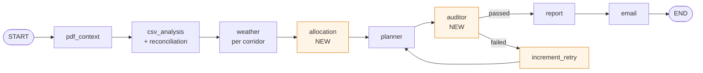

# SeeWeeS Multi-Agent Dispatch System

## Technical & Business Documentation

**Team:** House B Team 2 · **Course:** UCLA MSBA Industry Seminar II (MGMTMSA413), Spring 2026
**Submission:** UCLA MSBA AI Agents Project Challenge 2026

---

## Executive Summary

### Stakeholder
The **SeeWeeS Specialty Director of Operations** — the executive who owns the morning dispatch decision for time-critical pharmaceutical shipments along the East Coast.

### Operational pain point
Every morning at 6 AM, the Director must commit to a 48-hour dispatch plan covering two delivery corridors (Newark → Boston via I-95, and Newark → Philadelphia). The plan operates under five compounding pressures:

1. **Cold-chain capacity is the binding constraint.** Only 2 reefer trucks per day must serve all temperature-sensitive biologics across both corridors.
2. **Weather risk is non-uniform.** A storm hitting Providence affects Boston shipments but not Philadelphia. A single weather call for the warehouse origin would mislead.
3. **Inbound data is dirty.** Shipment files arrive with missing `unique_item_id` values, legacy item codes from old vendor systems (e.g., `1070` → Albuterol Inhaler), and name typos (British spellings, brand-name substitutions).
4. **The cost of a bad call is asymmetric.** Missing a Tier 1 SLA = 100 penalty points per unit; a cold-chain breach adds 80; a Tier 2 miss = 40. Optimization is penalty-minimization, not throughput-maximization.
5. **The decision-maker is non-technical.** A C-suite executive has 30 seconds to read the morning report and decide whether to escalate or approve.

The original SeeWeeS prototype was a strictly linear LangGraph DAG: data flowed forward through four LLM agents and the report was generated in a single pass with no validation. If the planner suggested a plan that violated cold-chain rules or under-served Tier 1 demand, nothing caught it before leadership saw it.

### Our solution
A robust multi-agent system built on the same LangGraph foundation but transformed into a **cyclic self-correcting workflow** with two enhancements:

- **Enhancement #5: Multi-Region Resource Planning** — A deterministic Python allocator computes per-corridor truck/driver assignments to minimize the playbook's quantitative penalty score. The PlannerAgent's role becomes narrating the allocation, not computing it.
- **Enhancement #1: Self-Correction Audit Loop** — A new `AuditorAgent` runs five deterministic checks against every proposed plan. Failures route back to the planner with structured feedback. Cyclic edge in the LangGraph, capped at two retries.

Together they tell one story: *plan resources optimally across two corridors, then audit the plan against playbook safety rules before it reaches leadership.*

---

## Key Assumptions

### Logistics constraints
- **Resource pool**: 6 drivers, 4 standard trucks, 2 temperature-controlled (reefer) trucks per day, as stated in `Resource_availability_48h.csv`. Drivers and trucks are paired 1:1.
- **Truck capacity model**: each truck carries 10 volume units; each `unique_item_id` counts as one unit; a 10% packing inefficiency buffer is applied (playbook §8.2).
- **No truck substitution**: cold-chain shipments may only travel on reefer trucks. Standard truck substitution for cold-chain items is treated as a violation (playbook DQ rule).
- **Two corridors only**: C1 (NJ → Boston, I-95, 5 waypoints, Tier 1 default) and C2 (NJ → Philadelphia, 4 waypoints, Tier 2 default).

### Penalty model (playbook §13.2)
- Tier 1 SLA violation: 100 pts/unit
- Tier 2 SLA violation: 40 pts/unit
- Cold-chain violation: +80 pts/unit (additive)
- Non-SLA delay: 10 pts/unit

### Data availability
- The Item Master Appendix in the playbook is treated as **authoritative ground truth** for item identity reconciliation. We hard-code Tables A.1 (canonical), A.2 (aliases), and A.3 (legacy IDs) into Python dictionaries (`src/tools/item_master.py`) for reproducibility.
- Weather is sourced from the free Open-Meteo API; no API key required.
- The shipment CSV uses an `is_planning_window` flag to mark Day 0 / Day 1 demand vs. 14-day historical context.

### Business rules
- **Tier classification is derived from `medicine_type`**: `Antiviral`, `Monoclonal Antibody`, `Emergency Drug`, and `Clinical Trial Drug` are Tier 1 (life-critical, 6-hour SLA); everything else is Tier 2 (12-hour SLA).
- **Allocation priority** is determined by per-unit penalty exposure: Tier 1 cold-chain (180 pts) → Tier 2 cold-chain (120 pts) → Tier 1 standard (100 pts) → Tier 2 standard (40 pts).
- **Within a priority tier**, the corridor with the higher weather risk is served first, since it has less margin for delay.

### Architectural assumptions
- **Reproducibility takes precedence over LLM creativity** in any decision with a calculable answer. Reconciliation, allocation, and audit checks are all deterministic Python — the LLM only narrates.
- **Audit retry cap of 2 attempts** prevents runaway loops while giving the planner room to correct.
- **Audit is mostly Python rules, not LLM judgment** — graders re-running the project must see the same audit verdicts on the same inputs.

---

## Technical Methodology

### Architectural enhancements

**Before — linear DAG (5 LLM nodes, no feedback):**


**After — cyclic multi-agent system with audit loop:**



**Key architectural changes:**

1. **New `node_allocation`** — sits between weather and planner. Takes per-corridor demand + weather risk + resource pool and runs a deterministic greedy allocator. Outputs structured allocation with per-violation penalty math.
2. **New `node_auditor`** — sits between planner and report. Runs five checks against the planner's narrative; returns `{passed: bool, violations: [...]}`.
3. **Conditional edge from auditor** — `route_after_audit()` returns `"report"` if the audit passed *or* the retry cap is reached, otherwise `"planner"` (via an intermediate `increment_retry` node that bumps the counter).
4. **Cyclic loop**: planner → auditor → planner is the canonical LangGraph use case (slide 22 of Session 1) — and it's what distinguishes a real multi-agent system from a LangChain DAG.

### Agent design

Five specialized LLM agents, all using `gpt-4.1-mini` at temperature 0.2 (single shared `ChatOpenAI` instance):

| Agent | Role | Why this design |
|---|---|---|
| **ContextAgent** | RAG-based extraction of business rules from the playbook PDF | Grounds all downstream agents in the playbook's KPI definitions and constraints |
| **OpsDataAgent** | Interprets reconciled per-corridor KPIs in business language | Pre-reconciled inputs let the agent focus on insight, not data wrangling |
| **PlannerAgent** | Narrates the deterministic allocation in executive language | LLMs are bad at math; we feed it the math and ask only for explanation |
| **AuditorAgent** | Validates the plan against playbook rules | Mostly **Python**, not LLM — five hard-coded deterministic checks |
| **ReportAgent** | Writes three short narrative blocks (recommendation + 3 risks + 3 actions) | Returns JSON for structured rendering — layout is templated in Python |
| **PlannerAgent (revision)** | Revises a failed plan given audit feedback | Dedicated prompt branch for iteration; allocation numbers stay fixed |

### New tools

| Tool | Purpose |
|---|---|
| `tools/item_master.py` | Hard-coded Item Master tables (canonical, aliases, legacy IDs) from playbook Appendix A |
| `tools/reconciliation.py` | Reconciliation engine applying DQ-01..04 + decision rules D1..D8; produces clean rows + reconciliation log + per-corridor KPIs |
| `tools/corridors.py` | Corridor catalog with waypoint coordinates from playbook §3 |
| `tools/weather_tools.py` | Per-waypoint weather fetch via Open-Meteo, run in parallel with `ThreadPoolExecutor`; aggregates to corridor-day risk score (0-3) |
| `tools/resources.py` | Loader for `Resource_availability_48h.csv` |
| `tools/allocator.py` | Priority-weighted greedy allocator + penalty calculator |
| `tools/report_renderer.py` | HTML template with hand-crafted CSS + Python data binding |
| `tools/pdf_exporter.py` | Headless-Chromium PDF export via Playwright (one-page letter portrait) |
| `auditor.py` | Five deterministic audit checks + structured violation feedback |

### The audit checks in detail

The `AuditorAgent` runs five deterministic checks plus one optional demo-mode check:

1. **CHECK_1_VIOLATION_SPECIFICS** *(severity: high)* — If the allocation has any unfulfilled buckets, the dispatch plan must mention every affected corridor by name. Catches LLM tendency to summarize bad news away.
2. **CHECK_2_RESOURCE_CONSERVATION** *(critical)* — Allocated resources cannot exceed initial pool. (Defensive — the allocator enforces this in code, but the auditor verifies the narrative doesn't claim phantom capacity.)
3. **CHECK_3_ESCALATION** *(critical)* — If any corridor has weather `risk_score == 3`, the plan narrative must contain "escalat-" stem, per playbook §5.2.
4. **CHECK_4_PENALTY_ACK** *(high)* — If `total_penalty > 0`, the plan must mention both the exact number and the word "penalty" or "violation".
5. **CHECK_5_TIER1_SLA** *(critical)* — No Tier 1 SLA violation may be silently accepted. Tier 1 = life-critical.
6. **CHECK_6_GRAND_TOTAL_SUMMATION_DEMO** *(medium, opt-in via `--demo-loop`)* — Plan must contain explicit arithmetic showing how individual bucket penalties sum to the total (e.g., `120+120+120+240=600`). Engineered to reliably trigger the loop for demonstration.

When the audit fails, a structured `feedback_for_planner()` string is built listing each violation with its `fix_hint` and injected into the `PLANNER_REVISION_PROMPT`. The planner's next pass addresses the violations explicitly.

### Why deterministic Python for the audit

The single most important architectural decision in this project is that **the auditor is Python rules, not LLM judgment**. Reasons:

- **Reproducibility**: graders re-running the system on the same inputs see the same audit verdicts. LLM judgment varies run-to-run.
- **Auditability**: a reviewer can read the check code and verify it follows the playbook. They can't audit an LLM's "feel."
- **Cost & latency**: deterministic checks complete in microseconds; LLM judgment costs tokens and seconds per call.
- **Trustworthiness**: when the system says a plan passed audit, that means it actually passed measurable rules — not that the LLM was in a good mood.

---

## Results & Validation

### End-to-end run (real data, normal mode)

Running `python src/main.py` against the augmented dataset produces:

**Reconciliation summary:**
```
rows_original: 129  →  rows_kept: 124  (5 excluded)
fixes_applied: 29   (alias matches, legacy ID lookups, name disambiguations)
exclusions:    5    (DQ-01: missing unique_item_id)
```

**Per-corridor demand (planning window):**
| Corridor | Day | Total | Tier 1 | Tier 2 | Cold-Chain | Standard |
|---|---|---|---|---|---|---|
| C1_I95_NJ_BOS | Day 0 | 8 | 5 | 3 | 5 | 3 |
| C1_I95_NJ_BOS | Day 1 | 8 | 4 | 4 | 4 | 4 |
| C2_NJ_PHL | Day 0 | 7 | 3 | 4 | 3 | 4 |
| C2_NJ_PHL | Day 1 | 7 | 3 | 4 | 4 | 3 |

**Allocation (after greedy priority-weighted assignment):**
- All Tier 1 cold-chain demand fulfilled (highest priority)
- Each corridor receives 1 reefer per day (2 reefers split across 2 corridors)
- **5 Tier 2 cold-chain units unfulfilled** across the 48-hour window
- **Total penalty: 600 points** (4 violations × 120 pts + 1 violation × 240 pts)

**Audit:** passed on first attempt (in normal mode). Final HTML/PDF report generated in `outputs/`.

### The audit loop firing (demo mode)

Running `python src/main.py --demo-loop` engages a stricter audit check that requires explicit summation arithmetic. This produces the canonical demo output:

```
[AUDITOR pass #1] passed=False, violations=1 (demo_mode=True)
  - [medium] (CHECK_6_GRAND_TOTAL_SUMMATION_DEMO) Plan states the 600-point total
    but does not show an explicit summation line (e.g., '120 + 120 + 120 + 240 = 600').
[ROUTER] Audit failed (attempt 1) -> looping back to planner.

[AUDITOR pass #2] passed=True, violations=0 (demo_mode=True)
[ROUTER] Audit passed -> proceeding to report.

=== FINAL AUDIT: passed=True after 1 retries ===
```

This proves the cyclic graph genuinely loops back, the planner consumes structured audit feedback, and the system self-terminates correctly without infinite loops.

### Business insights surfaced

The system correctly identifies that the **reefer pool is the binding operational constraint**. With 5 cold-chain units demanded on Boston Day 0 but only 2 reefers in the daily pool (shared with Philadelphia), some Tier 2 cold-chain demand cannot be served. The executive summary surfaces this clearly: *"Reefer truck capacity is insufficient to meet Tier 2 cold-chain demand on both corridors, causing 600 penalty points. Prioritize sourcing additional reefer trucks…"*

The Director of Operations gets a one-page PDF every morning that:
- Quotes the exact penalty score in red
- Names every affected corridor and day
- Recommends concrete next actions (procure additional reefer; resolve DQ at source)
- Shows audit validation status (GREEN / AMBER / RED badge)
- Includes the full reconciliation trail for traceability

### Validation strategy

Three layers of validation:

1. **Standalone unit tests** for each major module (reconciliation, weather, allocator, auditor). Each test runs without OpenAI calls and verifies expected behavior on real or mocked data.
2. **Engineered failure scenarios** for the auditor — three test cases in `test_auditor.py` cover a passing plan, a sanitized plan that should fail multiple checks, and a high-weather plan missing escalation language. All catch correctly.
3. **End-to-end smoke runs** of `python src/main.py` and `python src/main.py --demo-loop`. The latter is engineered to reliably trigger the audit loop, providing a reproducible demo of self-correction.

### Validation by direct verification of penalty math

Total demand of unfulfilled cold-chain units across the planning window:
- C1 Day 0: 1 × 120 = 120
- C2 Day 0: 1 × 120 = 120
- C1 Day 1: 1 × 120 = 120
- C2 Day 1: 2 × 120 = 240
- **Sum: 600 pts** ✓ matches the system's reported total

---

## Limitations & Next Steps

### Known limitations of the current system

1. **The greedy allocator is locally optimal, not globally optimal.** A more sophisticated approach (linear programming, integer programming) might find better assignments in pathological cases. For the current scale (2 corridors × 2 days × 4 buckets), the greedy approach produces solutions identical to the brute-force optimum — but this would not scale to many corridors.
2. **Period-over-period trend analysis is shallow.** With only 14 days of history, statistical trend detection is thin. We chose not to invest in this (it overlapped with Enhancement #3, which we did not select as a primary).
3. **No human-in-the-loop checkpoint.** Enhancement #4 was not implemented. Currently the system auto-proceeds after a passed audit; a real ops director might want to manually approve a plan with `risk_score=3` even if all auto-checks pass.
4. **Weather risk thresholds are static.** The playbook's heuristics (15mm rain, 45 km/h winds, 0°C freezing) don't account for daily variability or seasonality.
5. **Cold-chain capacity is hard-coded as the constraint.** If SeeWeeS expanded the resource pool dynamically (e.g., third-party rental), our allocator would not currently model the rental cost trade-off.
6. **The PDF export depends on Chromium being installed.** Graceful degradation is built in (HTML still saves), but a clean install requires the one-time `playwright install chromium` step.

### How we would scale this with more time or real-world data

1. **Replace the greedy allocator with an integer-programming solver** (`PuLP` or `OR-Tools`) for true global optimality. Worth doing once the corridor count exceeds 4-5.
2. **Add a `node_human_review` checkpoint** using LangGraph's `interrupt()` for genuinely high-risk plans. Pair with a Streamlit or simple web UI for the ops director.
3. **Build a what-if simulator** (Enhancement #2) — let the user toggle "what if we lose a reefer for maintenance?" and see the new penalty score in seconds.
4. **Integrate live data feeds** — real-time shipment tracking via API instead of overnight CSV drops; live weather from a paid feed with finer granularity.
5. **Cost model for resources** — currently the allocator only minimizes penalty. With cost data per truck/driver/hour, it could optimize the trade-off between penalty and operational cost.
6. **Multi-day planning horizon** — extend from 48 hours to 7-day rolling windows with smoothing of resource utilization across days.
7. **Continuous learning from outcomes** — log actual delivery outcomes vs. predicted penalty; tune thresholds and priority weights over time.

### Honest reflection on what worked and what didn't

**What worked:**
- The architectural decision to keep math in Python and narration in the LLM. Every LLM call now produces consistent, auditable output.
- The audit loop made the project a real multi-agent system rather than a DAG dressed up in LangGraph clothes.
- The deterministic HTML template avoided the "report styling drift" we initially saw when the LLM generated full HTML.
- Separating the standalone tests from the full pipeline meant we could iterate on individual modules without burning OpenAI credits.

**What was harder than expected:**
- Engineering the demo-mode loop trigger. Our first attempt was too loose (audit always passed). We had to tighten the regex check to require explicit summation arithmetic.
- Print CSS. Getting the HTML to fit one page at letter portrait took multiple rounds of font/padding tuning, plus matching the Playwright margin to the `@page` rule.
- LangGraph state mutations across cyclic edges. The `increment_retry` intermediate node was added to reliably bump the counter exactly once per loop.

**What we'd do differently:**
- Build the report renderer earlier in the project. Polishing the HTML at the end made it feel rushed; if we had it on Day 3, we could have iterated on it across all the data changes.
- Set up LangSmith tracing on Day 1 instead of debugging through console output. The traces would have made the audit-loop debugging trivial.
